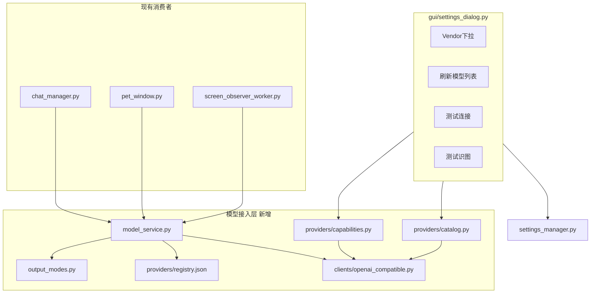
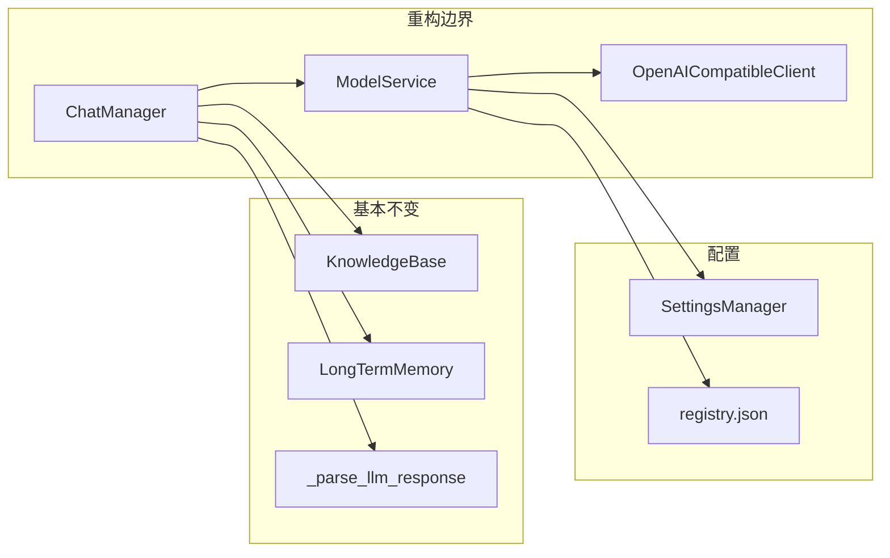

# LLM/VLM 配置体系分步升级计划

## 目标与原则

- **用户侧**：一次填写 API 连接（vendor + base_url + key），对话/识图分别选模型；模型从供应商 `GET /v1/models` 拉取，可手输兜底。
- **程序侧**：单一 `OpenAICompatibleClient` + `ModelService` 门面；`ChatManager` / 屏幕观察 / 长期记忆均经此层发请求。
- **智能能力**：探测并缓存「是否支持识图」「JSON 输出模式」；识图不支持时明确提示；JSON 不支持时自动降级为自然语言 + 现有 `_parse_llm_response` 情绪标签回退。
- **范围控制**：Phase 1 仅实现 **OpenAI 兼容协议**（覆盖当前全部调用路径）；Anthropic 原生 / Gemini 独立 API 记入后续扩展，不纳入本次。
- **Vendor 规模**：采用你确认的 **精选列表**（约 13 项 + 自定义），参考 [PicoClaw Providers](https://docs.picoclaw.io/docs/providers/) 的 `base_url` 约定，**不硬编码 model id**。



---

## 新配置 Schema（`settings.json`）

在 [`src/settings_manager.py`](src/settings_manager.py) 增加顶层 `models`（`schema_version: 2`），**保留** `llm` / `vision` 只读兼容期（`load()` 时若缺 `models` 则从旧键迁移并写回）。

```json
{
  "models": {
    "schema_version": 2,
    "connections": [{
      "id": "default",
      "vendor": "siliconflow",
      "protocol": "openai_compatible",
      "base_url": "https://api.siliconflow.cn/v1",
      "api_key": ""
    }],
    "chat": {
      "connection_id": "default",
      "model": "",
      "temperature": 1.0,
      "max_tokens": 512,
      "history_rounds": 10,
      "output_mode": "auto"
    },
    "vision": {
      "same_connection_as_chat": true,
      "connection_id": "default",
      "model": "Qwen/Qwen3-VL-32B-Instruct"
    },
    "capabilities_cache": {}
  }
}
```

| 字段 | 含义 |
|------|------|
| `chat.output_mode` | `auto`（默认）/ `json_preferred` / `natural_only` |
| `capabilities_cache["{conn_id}:{model_id}"]` | `supports_vision`, `json_mode`（`response_format` \| `prompt_only` \| `natural_only`）, `probed_at` |
| `vision.same_connection_as_chat` | 为 true 时识图与对话共用同一 connection 的 key/url |

**迁移规则**（`SettingsManager._migrate_models_v2()`）：

- `llm.api_key/base_url/model/provider` → 推断 `vendor`（deepseek/openai → 对应项，否则 `custom_openai`）→ 写入 `connections[0]` + `chat`
- `vision.api_key` + `vision.api_url` → 若与 llm 相同 host 则 `same_connection_as_chat=true`，否则第二 connection 或仍合并到 default（优先合并，减少用户困惑）
- 删除对 `vision.enabled` 的依赖（当前未使用）

**开发环境**：扩展 `_ENV_KEY_MAP` 映射到 `models.connections[0]` 与 `chat.model` / `vision.model`；更新 [`.env.example`](.env.example)（可选 `MODELS_VENDOR`、`MODELS_API_KEY` 等，保留旧变量名一版兼容）。

---

## Vendor 注册表（精选）

新建 [`src/llm/providers/registry.json`](src/llm/providers/registry.json) + [`src/llm/providers/registry.py`](src/llm/providers/registry.py)（加载、查 `base_url`、`list_models_path`）。

| vendor id | 显示名 | 默认 base_url |
|-----------|--------|----------------|
| `siliconflow` | 硅基流动 | `https://api.siliconflow.cn/v1` |
| `deepseek` | DeepSeek | `https://api.deepseek.com/v1` |
| `openai` | OpenAI | `https://api.openai.com/v1` |
| `openrouter` | OpenRouter | `https://openrouter.ai/api/v1` |
| `zhipu` | 智谱 AI | `https://open.bigmodel.cn/api/paas/v4` |
| `qwen` | 通义千问 | `https://dashscope.aliyuncs.com/compatible-mode/v1` |
| `moonshot` | Moonshot | `https://api.moonshot.cn/v1` |
| `mistral` | Mistral | `https://api.mistral.ai/v1` |
| `groq` | Groq | `https://api.groq.com/openai/v1` |
| `minimax` | MiniMax | `https://api.minimax.io/v1`（OpenAI 兼容；国内若使用 [minimaxi.com](https://platform.minimaxi.com) 控制台，可能需将 base_url 改为厂商文档给出的域名，或用 `custom_openai` 覆盖） |
| `ollama` | Ollama（本地） | `http://127.0.0.1:11434/v1` |
| `lmstudio` | LM Studio（本地） | `http://127.0.0.1:1234/v1` |
| `vllm` | vLLM（本地） | `http://127.0.0.1:8000/v1` |
| `custom_openai` | 自定义 OpenAI 兼容 | `""`（用户自填） |

本地三项默认不要求 API Key；云端项需 Key 才能刷新列表/探测。

---

## 分阶段实施

### Phase 0：应急修复（可单独发版）

**目的**：先消除用户已报的 `NoneType.strip` 与 JSON 400 导致整轮聊天失败。

| 改动 | 文件 |
|------|------|
| `description` / API `content` 空值防护，友好错误文案 | [`src/workers/screen_observer_worker.py`](src/workers/screen_observer_worker.py) |
| 抽取 `extract_message_content(data) -> str`（`None` → `""`；可选兼容 MiniMax 等 `reasoning_details` / `reasoning_content` 非空但 `content` 为空的情况） | 新建 `src/llm/clients/response_utils.py` 或并入 client |
| `_request_llm`：若 `response_format_json` 且 HTTP 4xx，去掉 `response_format` **重试一次**（最小策略链雏形） | [`src/llm/chat_manager.py`](src/llm/chat_manager.py) |

**验收**：

- 视觉 API 返回 `content: null` 时，气泡显示「视觉模型返回空描述，请检查是否选择了支持识图的多模态模型」，而非 Python traceback。
- 对不支持 `json_object` 的模型，聊天仍能收到回复（可能走标签解析）。

---

### Phase 1：模型接入层 + Schema 迁移（无 UI 大改）

**新增模块**：

```
src/llm/providers/registry.json
src/llm/providers/registry.py
src/llm/providers/catalog.py      # GET {base_url}/models，解析 data[].id
src/llm/clients/openai_compatible.py  # chat_completions, describe_image, list_models
src/llm/model_service.py          # 单例：resolve_connection(), get_client()
```

**改动**：

- [`src/settings_manager.py`](src/settings_manager.py)：`DEFAULTS` 增加 `models`；`load()` 调用迁移；新增便捷方法 `get_chat_binding()` / `get_vision_binding()` 返回 `(connection, model, extras)`。
- [`src/llm/chat_manager.py`](src/llm/chat_manager.py)：`_request_llm` 内部改为调用 `ModelService.chat_completion()`（行为与 Phase 0 一致）。
- [`src/vision/qwen_vision.py`](src/vision/qwen_vision.py)：改为薄封装，委托 `OpenAICompatibleClient.describe_image()`（便于 Phase 5 删除重复逻辑）。

**验收**：

- 旧 `config/settings.json`（仅 `llm`/`vision`）启动后自动出现 `models`，且聊天/屏幕观察行为与升级前一致。
- 单元级：对 mock `GET /v1/models` 能解析模型 id 列表；`chat_completions` URL 拼接与现逻辑一致（`base_url` + `/chat/completions`）。

---

### Phase 2：能力探测与缓存

**新增** [`src/llm/providers/capabilities.py`](src/llm/providers/capabilities.py)：

| 探测 | 方法 | 写入缓存 |
|------|------|----------|
| JSON native | 极简 messages + `response_format: json_object` | `json_mode=response_format` 或失败 |
| JSON prompt-only | 无 response_format，system 要求 `{"ok":true}` | `json_mode=prompt_only` 或失败 |
| 否则 | - | `json_mode=natural_only` |
| Vision | 1×1 PNG base64 + `image_url` 多模态请求 | `supports_vision=true/false` |

**新增 Worker**（不阻塞 UI）：

- [`src/workers/model_list_worker.py`](src/workers/model_list_worker.py) — `finished(list[str])` / `error(str)`
- [`src/workers/capability_probe_worker.py`](src/workers/capability_probe_worker.py) — 对当前 chat/vision 选中模型写 `capabilities_cache`

**Catalog 辅助**：`filter_vision_candidates(model_ids) -> list[str]`（启发式：`-VL`、`vision`、`gpt-4o` 等；供 UI 默认过滤，非硬拒绝）。

**验收**：

- 选手写纯文本模型作 vision，`probe` 后 `supports_vision=false`。
- 缓存存在时，启动不重复探测（除非用户点「测试连接/测试识图」或模型变更）。

---

### Phase 3：JSON 输出策略链（核心业务）

**新增** [`src/llm/output_modes.py`](src/llm/output_modes.py)：

```text
auto 策略链:
  A) response_format + JSON system 指令
  B) 无 response_format + JSON system 指令  → _parse_llm_response
  C) 无 JSON 指令 + _get_emotion_tag_prompt  → _parse_llm_response 回退
```

**改动** [`src/llm/chat_manager.py`](src/llm/chat_manager.py)：

- `_build_chat_messages()`：根据 `output_mode` + 缓存的 `json_mode` 决定注入 `_get_json_output_instruction()` 或 `_get_emotion_tag_prompt()`。
- `chat_with_tag`：经 `ModelService.chat_with_policy()`，不再直接硬编码 `response_format_json=True`。
- `_extract_memory_from_screen_description` / `LongTermMemory` merge：使用 **仅 A→B** 的轻量 JSON 策略，失败则跳过（不阻断主流程）。
- `send_screen_observation_with_tag`：**永不**使用 `response_format`（保持现状）。

**验收**：

- DeepSeek/SiliconFlow 文本模型：`auto` 下聊天正常；`memory_to_save` 在 JSON 成功时有，降级后无（与现行为一致且文档说明）。
- 控制台可见 `[OutputMode] 使用 response_format` / `降级 prompt_only` / `降级 natural` 日志。

---

### Phase 4：设置 UI 重构

**改动** [`src/gui/settings_dialog.py`](src/gui/settings_dialog.py) 模型标签页：

```text
┌ API 连接 ─────────────────────────────┐
│ 服务商 [硅基流动 ▼]  Base URL [____]   │
│ API Key [____]  [测试连接] [刷新模型]  │
│ 状态: 已连接 / 共 N 个模型             │
└───────────────────────────────────────┘
┌ 对话模型 ─────────────────────────────┐
│ 模型 [可编辑 ComboBox]                 │
│ 回复格式 [自动 ▼]  Temperature ...    │
└───────────────────────────────────────┘
┌ 屏幕识图模型 ─────────────────────────┐
│ ☑ 与上方使用同一 API 连接              │
│ 模型 [ComboBox·默认过滤多模态]         │
│ [测试识图]                             │
└───────────────────────────────────────┘
```

- 移除 `_on_provider_changed` 写死 `deepseek-chat` / `gpt-4o-mini`。
- 保存时：写 `models`；若开启屏幕监视且 `supports_vision=false` → `QMessageBox.warning`（允许保存但警告，或禁止开启监视——建议 **警告 + 保存时若勾选监视则二次确认**）。
- 「测试识图」失败：展示明确原因（非多模态 / Key 无效 / 网络）。

**验收**：

- 新用户：选 SiliconFlow → 填 Key → 刷新 → 选 VL 模型 → 测试识图通过 → 开屏幕监视可用。
- 旧用户升级：打开设置可见原 Key/模型，保存一次后写入新 schema。

---

### Phase 5：消费者接入与热更新

| 文件 | 改动 |
|------|------|
| [`src/gui/pet_window.py`](src/gui/pet_window.py) | `_ensure_vision_client` 改用 `ModelService`；`settings_changed` 时 `vision_client=None` 强制按新配置重建 |
| [`src/workers/screen_observer_worker.py`](src/workers/screen_observer_worker.py) | 可选：接收 `ModelService` 而非裸 `vision_client` |
| [`src/vision/qwen_vision.py`](src/vision/qwen_vision.py) | 标记 deprecated，保留 re-export 一版 |

**验收**：

- 设置里改 Key/模型后无需重启，聊天与屏幕观察使用新配置。
- 打包版（无 `.env`）仅依赖 `settings.json` 新结构。

---

### Phase 6：文档与模板

按 [项目总则](.cursor/rules/indra-project-core.mdc) 更新：

| 文档 | 内容 |
|------|------|
| [`docs/07-数据结构.md`](docs/07-数据结构.md) | `models` schema、`capabilities_cache`、`output_mode` |
| [`docs/03-程序架构.md`](docs/03-程序架构.md) | 模型接入层、探测流程、JSON 策略链图 |
| [`docs/02-技术要点.md`](docs/02-技术要点.md) | vendor 列表、/v1/models、降级行为 |
| [`docs/05-开发环境配置.md`](docs/05-开发环境配置.md) | `.env` 新变量 |
| [`docs/04-开发进度.md`](docs/04-开发进度.md) | 勾选完成项 |
| [`docs/08-实现计划.md`](docs/08-实现计划.md) | 新增「阶段八：模型配置升级」 |
| [`.env.example`](.env.example) | 补充 `MODELS_*` 示例 |

**验收**：文档中的字段名与 `SettingsManager` / UI 一致；README 设置说明指向新 UI 流程。

---

## 架构兼容性与潜在风险（开发前审阅）

### 与现有架构的兼容性（结论：可渐进接入，需注意过渡层）

| 现有模块 | 升级后关系 | 兼容性 |
|----------|------------|--------|
| [`SettingsManager`](src/settings_manager.py) 单例 + `settings_changed` | 扩展 `models` 顶层键；`get()` 过渡期对 `llm.*` / `vision.*` 做**读透传**（从新 schema 合成旧视图），避免 Phase 1–3 旧 UI 写新/读旧不一致 | 必须做适配层，否则半升级状态会坏 |
| [`ChatManager`](src/llm/chat_manager.py)（Persona、RAG、历史、JSON 解析） | **职责不变**；仅 HTTP 下沉到 `ModelService`；`_parse_llm_response` / 情绪标签逻辑保留 | 高兼容 |
| [`KnowledgeBase`](src/llm/knowledge_base.py) | 无直接依赖 LLM 配置键 | 无影响 |
| [`LongTermMemory`](src/llm/long_term_memory.py) | `merge_llm_caller` 改走 `ModelService` + JSON 轻量策略 | 需保证 merge 失败不抛到 UI |
| [`ChatBubble`](src/gui/chat_bubble.py) + Worker 线程 | 仍只调 `ChatManager.chat_with_tag` | 无接口变更则无影响 |
| [`PetWindow`](src/gui/pet_window.py) + [`ScreenObserveWorker`](src/workers/screen_observer_worker.py) | vision 从 `ModelService` 取 client；`settings_changed` 清空缓存实例 | Phase 5 前热更新可能仍短暂陈旧 |
| [`QwenVisionClient`](src/vision/qwen_vision.py) | 薄封装 → 最终废弃 | 短期保留 re-export |
| 打包 [`resource_path`](src/utils.py) | `registry.json` 须纳入 PyInstaller 资源列表（与 `config/` 同级策略） | 漏打包会导致 vendor 列表为空 |
| 开发 `.env` [`_ENV_KEY_MAP`](src/settings_manager.py) | 新旧变量并存一版；优先映射到 `models.connections[0]` | 避免开发者 .env 失效 |



**分层原则**：新增「模型接入层」插在 **基础设施 ↔ 业务层** 之间，不打破 `docs/03-程序架构.md` 中「GUI 不直接发 LLM 请求」的约定；`settings_dialog` 只通过 `SettingsManager` 与 Worker 信号交互。

### 潜在风险清单（按优先级）

| 优先级 | 风险 | 后果 | 规避（写入各 Phase 验收） |
|--------|------|------|---------------------------|
| P0 | 迁移一次性写坏 `settings.json` | 用户配置丢失 | 迁移前内存备份；已有 `.broken` 机制沿用；`schema_version` 幂等；迁移后保留旧 `llm`/`vision` 只读副本一版（可选 `models._migrated_from_v1`） |
| P0 | 旧 `vision.api_url` 存的是**完整** `.../chat/completions`，新 schema 存 **base_url** | 请求 404 或双路径 | `OpenAICompatibleClient` 统一规范化：无论存入的是 base 还是完整 URL，都规范到 `{base}/chat/completions`；迁移时 strip 后缀 |
| P0 | 旧 `llm.provider=custom` 时 base_url 即完整 endpoint | 与「base + /v1/chat/completions」逻辑冲突 | 检测 URL 已含 `chat/completions` 则不再拼接（延续现 [`chat_manager.py`](src/llm/chat_manager.py) L411–417 行为） |
| P1 | Phase 1–3 **旧设置 UI** 仍写 `llm`/`vision`，运行读 `models` | 保存无效或读不到 Key | `SettingsManager.set("llm", ...)` 同步镜像到 `models`；或 Phase 1 末强制 `load()` 后双向同步 |
| P1 | `SettingsManager.get("llm","api_key")` 与 `get("models",...)` 不一致 | .env / 打包版行为分裂 | 单一真相源：`models`；旧键仅 getter 适配 |
| P2 | 部分 vendor 无 `GET /v1/models` 或返回空 | 下拉为空 | 可手输 ComboBox；状态文案说明；不阻断保存 |
| P2 | 能力探测误报（启发式把文本模型标成 vision） | 用户开监视后仍失败 | **以「测试识图」实测为准**；缓存 `supports_vision`；运行时仍做 content 空值防护（Phase 0） |
| P2 | 探测误报 JSON 能力 | 多余重试或仍 400 | Phase 3 完整策略链 A→B→C；不依赖探测 100% 准确 |
| P2 | 每次测试连接多次 probe 触发 **限流/扣费** | 用户额度浪费 | 仅按钮触发；缓存 `capabilities_cache`；probe 用最小 token |
| P3 | JSON 降级到自然语言后 **长期记忆不写** | 用户以为记忆坏了 | UI 说明 + `docs`；`output_mode=auto` 时控制台打 `[OutputMode]` 日志 |
| P3 | MiniMax 等 **推理模型** 把正文放在 `reasoning_details`，`content` 为 null | 与当前 vision/聊天 bug 同类 | `extract_message_content` 扩展：若 `content` 空则尝试 `reasoning_content` / 厂商扩展字段（Phase 0/1 列入） |
| P4 | 大改 `settings_dialog` 引入 Qt 线程竞态 | 刷新列表时崩溃 | 所有网络仅 Worker；结果用 Signal 回主线程 |
| P5 | `vision_client` 懒加载缓存未清空 | 热更新不生效 | `settings_changed` → `vision_client=None`；`ModelService` 按 connection 缓存 key 失效 |
| 打包 | PyInstaller 未包含 `src/llm/providers/registry.json` | 运行期 vendor 列表失败 | 更新 spec / datas；启动时校验 registry 可加载 |

### 建议的过渡策略（降低架构撕裂）

1. **Phase 1 必做**：`SettingsManager` 实现 `models` 为唯一写入目标；对 `get("llm", ...)` / `get("vision", ...)` 提供只读适配（从 `models` 投影），直到 Phase 4 新 UI 上线。
2. **Phase 1–3**：旧 UI 保存时同时调用 `_sync_legacy_llm_vision_from_models()` 或反向同步，保证用户仍用旧界面时不丢配置。
3. **Phase 4 完成后**：设置页只写 `models`；legacy 键可停止写入（保留读取一版供回滚）。
4. **不改动**：RAG 索引线程、动画、托盘、聊天气泡布局——减少无关回归面。

---

## 建议 PR / 合并顺序

**说明**：原 Gantt 因任务名含中文/空格，部分 Markdown 预览会把代码块与正文粘连导致语法报错；下列改用**英文任务 id** 的 Gantt，并附表格备份。

```mermaid
gantt
    title ImplementationOrder
    dateFormat X
    axisFormat %s
    section Independent
    Phase0_Hotfix :p0, 0, 1
    Phase1_Infra :p1, after p0, 2
    section AfterPhase1
    Phase2_Capabilities :p2, after p1, 2
    Phase3_OutputModes :p3, after p2, 2
    section AfterPhase2And3
    Phase4_SettingsUI :p4, after p3, 3
    Phase5_Wireup :p5, after p4, 1
    Phase6_Docs :p6, after p5, 1
```



| 阶段 | 依赖 | 可合并性 | 用户可见变化 |
|------|------|----------|--------------|
| P0 应急修复 | 无 | 可单独发补丁 | 更少 traceback；部分模型聊天恢复 |
| P1 接入层与迁移 | P0 | 可独立 | 无（旧 UI） |
| P2 能力探测 | P1 | 需 P1 | 无（旧 UI） |
| P3 JSON 策略链 | P2 | 需 P2 | 无（行为更稳） |
| P4 设置 UI | P3 | 需 P3 | **主里程碑** |
| P5 热更新 | P4 | 需 P4 | 改设置即时生效 |
| P6 文档 | P5 | 需 P5 | 文档 |

- **P0** 可先发补丁版，缓解现有用户报错。
- **P1–P3** 在旧设置界面下用自动迁移 + 控制台日志验证后端。
- **P4** 是用户可见的主里程碑。
- 每阶段结束运行：`python src/main.py`，手动验证聊天 + 屏幕观察 + 设置保存/热更新。

---

## 风险与规避（运营与供应商）

| 风险 | 规避 |
|------|------|
| 部分供应商无 `/v1/models` | 刷新失败时 ComboBox 可手输；状态栏提示 |
| 智谱/通义/MiniMax 等区域域名差异 | registry 预置 + `custom_openai` 覆盖 base_url；文档注明国内域名 |
| 探测增加 API 调用次数 | 仅「测试连接/测试识图/模型变更」触发；结果缓存 |
| 迁移覆盖用户自定义 URL | 迁移只运行一次；`schema_version` 标记；URL 规范化函数单测 |

---

## 不在本次范围（记录为后续）

- Anthropic Messages / Gemini 原生协议客户端
- 多 connection 并行（如对话用 DeepSeek、识图用 SiliconFlow）— schema 已预留 `connection_id`，UI 第一版仅支持 default + `same_connection_as_chat`
- OpenRouter 专用 metadata 精细过滤（第一版用启发式 + 实测）
