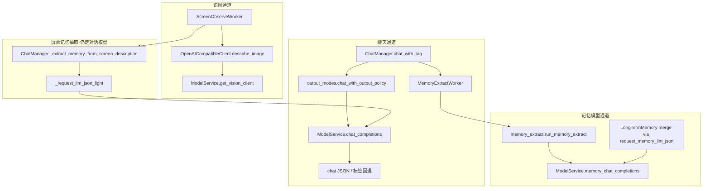

# LLM 通信层梳理与防幻觉加固

## 你这次事故的根因（已对照代码确认）

你贴出的回复形态是：**数千字角色扮演正文 + 末尾 ```json { ... 未闭合`**。

当前解析链在 [`src/llm/clients/text_sanitize.py`](src/llm/clients/text_sanitize.py) 的 `extract_json_payload()` 中：

```66:78:src/llm/clients/text_sanitize.py
    block = re.search(r"```(?:json)?\s*(\{[\s\S]*?\})\s*```", s, re.IGNORECASE)
    ...
    start = s.find("{")
    end = s.rfind("}")
    if start >= 0 and end > start:
        return s[start : end + 1].strip()
    return s  # 无闭合 } 时退回「整段原文」
```

当 JSON **没有闭合 `}`** 时，函数会 **`return s`（整段 hallucination）** → [`chat_manager._parse_llm_response`](src/llm/chat_manager.py) 里 `json.loads` 失败 → 走「回退标签解析」→ **把整段（含 ```json 残片）当作 reply 展示并写入 `chat_history`** → 下一轮 system+history 继续放大漂移。

这与「情绪标签未剥离」是同一链条：**不是 emotion 正则失效，而是根本没进入 JSON 成功分支**（且 `emotion` 在残缺 JSON 里，回退路径也提取不到）。

`memory_to_save` 出现在输出里，是因为 **prompt 仍要求该字段**（见下），模型照抄 schema；**聊天路径已不再写入库**，属于**契约冗余 + 误导模型**，不是功能回退。

---

## 现状：四条 LLM 通道（应分离、勿混用）



| 通道 | 绑定 | 期望输出 | 当前解析入口 | 主要风险 |
|------|------|----------|--------------|----------|
| 聊天 | `models.chat` | `{reply, emotion}` | `_parse_llm_response` + `extract_json_payload` | 残缺 JSON → 全文回退；history 存脏数据 |
| 屏幕评论 | `models.chat` | 自然语言 + 【情绪】 | `_extract_and_strip_emotion_tag` | 与 JSON 指令无关，较稳 |
| 屏幕记忆 | **仍用 chat 模型** | `{memory_to_save, topic}` | 独立 JSON 解析 | 与聊天 schema 混淆；应迁到 memory 模型 |
| 聊天记忆抽取 | `models.memory` | `{memories:[]}` | `memory_extract.parse_extract_response` | 相对独立 |
| 记忆整理 | `models.memory` | merge JSON | `long_term_memory` | 相对独立 |

---

## 冗余与残留清单（整理目标）

| 项目 | 位置 | 建议 |
|------|------|------|
| 聊天 JSON 含 `memory_to_save` / `favorability_delta` | [`chat_manager._get_json_output_instruction`](src/llm/chat_manager.py) L54-59 | **删除字段**；prompt 只保留 `reply`+`emotion` |
| 解析返回 6 元组含未使用字段 | `_parse_llm_response` | 改为 `ChatParseResult` 仅 `reply, emotion, ok` |
| `chat_with_tag` 不解构 `memory_to_save` 写库 | 已不写库 | 去掉解析与日志中的 dead code |
| 屏幕记忆用对话模型 + `memory_to_save` schema | `_extract_memory_from_screen_description` | **Phase 2** 改为调用 `run_memory_extract` 或专用 screen prompt + **memory 模型** |
| `memory_extract.parse_extract_response` 兼容 `memory_to_save` 单条 | [`memory_extract.py`](src/llm/memory_extract.py) L75-80 | 保留只用于旧响应兼容，文档标明 deprecated |
| 双轨 JSON 指令：`response_format` + Markdown 代码块示例 | system prompt + OpenAI client | `response_format` 成功时 **禁止** 在 prompt 里强调 ```json 包裹（减少「正文+代码块」双输出） |
| `extract_json_payload` 与 `parse_chat_completion` 职责重叠 | text_sanitize vs response_utils | 合并到 **`llm/parsers/`** 单一模块 |
| `qwen_vision.py` 薄封装 | 仍被 worker 使用 | 保留别名，文档标注「委托 ModelService」即可 |
| 文档仍写主聊天写 `memory_to_save` | [`docs/04-开发进度.md`](docs/04-开发进度.md) 等 | Phase 3 同步 |

---

## 分阶段实施（你已选：分阶段 + 解析失败重试后报错）

### Phase 1 — 紧急：解析加固 + 防历史污染（优先）

**1.1 新建聊天解析结果类型** — `src/llm/parsers/chat_response.py`（或 `schemas/chat_output.py`）

```python
@dataclass
class ChatParseResult:
    reply: str
    emotion: str
    ok: bool
    error: str | None  # incomplete_json | invalid_json | empty_reply
```

**1.2 重写 JSON 提取逻辑**（替代危险的 `return s` 全量回退）

- 优先：`response_format` 场景下 `content` 应已是纯 JSON → 直接 `json.loads`
- 其次：匹配 **完整** 的 ` ```json ... ``` ` 块（要求闭合 fence + 括号平衡）
- 再次：从最后一个 `{` 起做 **括号平衡扫描**，仅当得到完整 object 才 `json.loads`
- **禁止**：无闭合 `}` 时把整段原文当 payload
- 若检测到「```json 开头但未闭合」→ 标记 `error=incomplete_json`，**丢弃 ```json 之前的 prose**（不把 prose 当 reply）

**1.3 收紧 `_parse_llm_response` 行为**

- JSON 成功：只取 `reply`/`emotion`；对 `reply` 再 `strip_reasoning_artifacts`
- JSON 失败：**不**把全文交给 `_extract_and_strip_emotion_tag` 作为默认路径
- 按你的选择：**自动重试 1 次** — 在 `chat_with_tag` 内追加短 system 补丁（「上轮格式错误，只输出一个 JSON，字段仅 reply/emotion，禁止任何其它文字」），仍失败 → 返回 `error_message`，**`_append_assistant` 不写入**（或只写占位「（本轮回复格式异常，未记入上下文）」）

**1.4 历史与长度护栏**

- `_append_assistant` 前：`len(reply) > max_reply_chars`（如 800，可进 `settings`）→ 截断 + 日志
- 拒绝写入：解析失败轮次（避免上下文雪崩）

**1.5 日志**

- 打印 `parse_mode=json_ok|json_incomplete|fallback_tag|retry` 与 `reply_len`，便于对照终端

---

### Phase 2 — 契约瘦身 + 通道对齐

**2.1 聊天 JSON schema 只保留两字段**

- 更新 [`chat_manager._get_json_output_instruction`](src/llm/chat_manager.py)：
  - 删除 `memory_to_save` / `memory_topic` / `favorability_delta` 的示例与说明
  - `response_format` 模式下改为：「只输出 JSON 对象，不要用 Markdown 代码块包裹」
  - `prompt_only` 降级模式才保留代码块示例（与 [`output_modes`](src/llm/output_modes.py) 策略一致）

**2.2 集中「输出策略 + 解析」**

- 新模块 `src/llm/pipelines/chat_pipeline.py`（名称可微调）：
  - `build_chat_messages()`（从 ChatManager 迁出或委托）
  - `call_chat_model()` → `LLMChatResult`
  - `parse_chat_output(raw) -> ChatParseResult`
- `ChatManager` 变薄：历史、RAG、记忆调度、屏幕评论

**2.3 屏幕长期记忆抽取迁到 memory 模型**

- `_extract_memory_from_screen_description` 改为复用 [`run_memory_extract`](src/llm/memory_extract.py)（单条 user 载荷 = 屏幕描述），或 `memory_extract.md` 增「屏幕观察」小节
- 删除对话模型上的 `memory_to_save` 专用 prompt

**2.4 `favorability_delta`**

- 若近期无游戏化计划：从 prompt/解析/文档移除；若保留扩展点：移到 `docs/08` 备注，不进运行时 schema

---

### Phase 3 — 稳定性与文档

**3.1 统一请求层**

- 所有结构化调用经 `ModelService` + `reasoning_extras`（已有 [`reasoning_extras.py`](src/llm/clients/reasoning_extras.py)）
- 聊天：`profile=chat`；记忆/JSON 探测：`profile=structured`
- 可选：设置项 `models.chat.thinking_level`（off/high）映射 DeepSeek `thinking.type`（后续增强，非 Phase 1 阻塞）

**3.2 能力探测与运行时一致**

- 设置页「测试连接」写入的 `json_mode` 与聊天实际 `output_mode` 一致；探测使用与线上一致的 `parse_chat_output`

**3.3 文档更新**（项目规则要求）

- [`docs/03-程序架构.md`](docs/03-程序架构.md)：四条通道表、解析失败不重试写入 history
- [`docs/02-技术要点.md`](docs/02-技术要点.md)：聊天 schema、与 memory_extract 边界
- [`docs/04-开发进度.md`](docs/04-开发进度.md)：移除「主聊天 memory_to_save」表述
- [`docs/07-数据结构.md`](docs/07-数据结构.md)：若新增 `max_reply_chars` / `thinking_level`

**3.4 回归检查清单（手动）**

- DeepSeek v4-flash：多轮后仍只出 JSON 或干净回退
- 故意截断 max_tokens：应触发 retry → 红气泡，history 无万字污染
- 长期记忆开：聊天后 MemoryExtract 仍正常，与聊天 JSON 无关
- 屏幕观察：评论 + 记忆抽取互不串 schema

---

## 幻觉控制原则（写入实现约束）

1. **解析失败 ≠ 展示原文**：宁可短错误提示，不把模型 drift 全文给用户或 history。
2. **history 只存 canonical reply**：永不存 raw LLM 输出、```json 残片、reasoning。
3. **一通道一 schema**：聊天不出现 memory 字段；记忆抽取不出现 reply/emotion。
4. **指令与 API 一致**：`json_object` 就不要再教模型包 Markdown 代码块。
5. **多轮污染截断**：解析失败不 append；超长 reply 截断。

---

## 不在本轮范围（可后续单列）

- 流式输出与思考链增量 UI
- Tool call + `reasoning_content` 多轮回传（桌宠暂无 agent tools）
- 自动切换模型 fallback（PicoClaw 式 routing）
