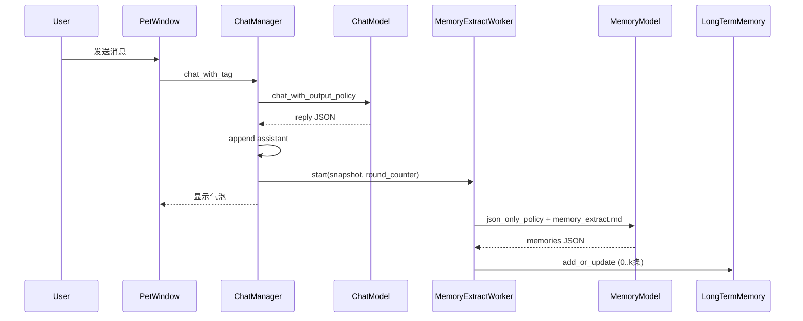

# 聊天长期记忆后台抽取方案

## 目标与边界

**纳入**

- 设置页「记忆管理」标签：记忆 LLM API（镜像 [识图模型](d:\Github\Indra_Desktop_Pet\src\gui\settings_dialog.py) 的「与对话同一 API」+ 独立连接 + 模型选择 + 可选「测试 JSON」）
- `models.memory` + `connections.memory`（与 vision 同构）；整理合并与聊天抽取**共用**该 API
- 聊天路径：**主 LLM 返回并写入 history 后**启动 `MemoryExtractWorker`（QThread，不阻塞气泡）
- 独立 prompt 文件 + 结构化 JSON 输出（复用 `json_only_policy` / `capabilities_cache.json_mode`）
- 触发规则（按你的确认）：
  - **附带轮数 N = 1**：每完成 1 轮对话（1 user + 1 assistant）抽取 1 次，payload 仅该轮
  - **附带轮数 N > 1**：每累计 **N 轮**对话抽取 1 次，payload 为最近 **N 轮**完整对话
- 屏幕观察记忆路径 [**不改**](d:\Github\Indra_Desktop_Pet\src\llm\chat_manager.py) `_extract_memory_from_screen_description`

**不纳入**

- 独立 OS 进程 / MCP 服务；主聊天保留 `memory_to_save` 字段（避免破坏 JSON 形状，但**不再写入库**）
- debounce、用户未要求的「附带已有记忆 Top-K」（可留接口，默认关闭）

---

## 关于 token：system 每次都会发，是否正常？

是的。每次 API 调用都会发送 **system（抽取规则）**，这是 OpenAI 兼容 API 的常态，无法省略。

可控的 token 主要来自 **user 载荷**：

| 部分 | 策略 |
|------|------|
| system | 固定 [`config/prompts/memory_extract.md`](config/prompts/memory_extract.md)，保持精简（规则 + JSON 示例，不含 persona/RAG） |
| user 对话片段 | 由「附带最近 N 轮」决定；N=1 最短 |
| 触发频率 | N>1 时每 N 轮才调 1 次 API，避免「长上下文 × 每轮一次」 |

不在主聊天 system 里塞记忆抽取说明 → 主聊天 token 反而下降。

---

## 数据流



**时序要点**：Worker 在 `_append_assistant` **之后**启动；传入 `chat_history` 的**快照**（`list(copy)`），避免与下一轮竞态。若上一轮 Worker 仍在跑，**取消/忽略旧结果**（仅保留最新 `generation_id`），防止乱序写库。

---

## 1. 配置与模型绑定

### 1.1 [`src/settings_manager.py`](src/settings_manager.py)

- `MODELS_DEFAULTS` 增加 `memory`（对齐 vision）：

```python
"memory": {
    "same_connection_as_chat": True,
    "connection_id": "default",
    "model": "",  # 空则回退 chat.model
    "extract_context_rounds": 1,  # 1=仅本轮；>1=附带最近N轮且每N轮触发一次
}
```

- 新增 `get_memory_binding()`：逻辑同 `get_vision_binding()`，`connection_id` 独立时为 `memory`
- `_migrate_models_v2` / `_apply_env_to_models`：可选 `MODELS_MEMORY_*`、`MODELS_MEMORY_MODEL`（[docs/05](d:\Github\Indra_Desktop_Pet\docs\05-开发环境配置.md) 补充）
- `behavior` 无需新开关：仍用现有 `long_term_memory_enabled`

### 1.2 [`src/llm/model_service.py`](src/llm/model_service.py)

- `get_memory_client()` → `OpenAICompatibleClient`
- `memory_chat_completions(messages, *, response_format_json)`：读 memory binding 的 temperature/max_tokens（可在 `models.memory` 增加 `temperature` 默认 0.2、`max_tokens` 默认 512）
- 配置变更时 `reset_cache()` 已存在，PetWindow 热更新需确保 memory client 刷新

### 1.3 [`src/gui/settings_dialog.py`](src/gui/settings_dialog.py) — 记忆管理标签页顶部

在 [`_build_memory_tab`](d:\Github\Indra_Desktop_Pet\src\gui\settings_dialog.py) 列表上方增加 `QGroupBox("记忆录入 / 整理模型")`：

- `memory_same_connection_cb`（与 vision 同款）
- 复用 `_append_api_connection_form(..., prefix="memory")` 或抽小函数避免三份重复
- `memory_model_combo` + 刷新列表
- `memory_context_rounds_spin`（1–5，标签说明：1=每轮抽取仅本轮；2–5=每 N 轮抽取并附带最近 N 轮）
- 可选 `memory_max_tokens_spin`、`memory_temperature`（折叠或默认隐藏，高级用户可调）
- 「测试 JSON 输出」按钮 → 轻量探测写入 `capabilities_cache`（复用 [`probe_json_mode`](d:\Github\Indra_Desktop_Pet\src\llm\providers\capabilities.py)）

`_load_values` / `_save_models_to_settings` 读写 `models.memory` 与 `connections`。

---

## 2. Prompt 与抽取逻辑

### 2.1 新文件 [`config/prompts/memory_extract.md`](config/prompts/memory_extract.md)

中文规则，建议包含：

- **应记**：用户稳定偏好、事实、项目、承诺、明确「记住」、对已有记忆的更正
- **不记**：纯 RP、一次性寒暄、无跨会话价值、仅重复已知且无新信息
- **输出 JSON**（Markdown 代码块包裹）：

```json
{"memories":[{"content":"…","topic":"…"}]}
```

无内容时 `{"memories":[]}`

### 2.2 新模块 [`src/llm/memory_extract.py`](src/llm/memory_extract.py)

- `load_extract_system_prompt()`：`resource_path("config/prompts/memory_extract.md")`
- `build_extract_user_payload(history_slice: list[dict]) -> str`：格式化最近 N 轮 user/assistant（跳过屏幕评论前缀行可选）
- `parse_extract_response(raw) -> list[tuple[content, topic]]`：`extract_json_payload` + 校验
- `run_memory_extract(history_slice, settings_manager) -> list[...]`：组 messages → `ModelService.memory_chat_completions` + `json_only_policy`（读 memory 模型 `capabilities_cache` 的 `json_mode`，与聊天相同策略）

### 2.3 [`src/workers/memory_extract_worker.py`](src/workers/memory_extract_worker.py)

- `Signal`：`finished(int written_count)` / `error(str)`
- `run()`：检查 `long_term_memory_enabled` → 调用 `run_memory_extract` → 循环 `add_or_update`
- 日志：`[MemoryExtract] 写入 n 条` / 跳过原因

---

## 3. 聊天集成与触发计数

### 3.1 [`src/llm/chat_manager.py`](src/llm/chat_manager.py)

- `LongTermMemory(..., merge_llm_caller=...)` 改为调用 **memory 专用** LLM（新建 `_request_memory_llm_json`，内部用 `get_memory_binding()`，不再走 `get_chat_binding()`）
- `chat_with_tag` 末尾：
  - **删除** `memory_to_save` → `add_or_update` 块（约 228–236 行）
  - `_get_json_output_instruction()`：**移除** memory 字段说明（或标注 deprecated 恒 null），减小主聊天 prompt
  - 若 `long_term_memory_enabled`：`_schedule_memory_extract()` 
- `_schedule_memory_extract()`：
  - `self._completed_rounds += 1`（每成功 append assistant 计 1 轮）
  - 读 `extract_context_rounds = N`
  - 若 `N == 1` 或 `_completed_rounds % N == 0`：取 `chat_history[-2*N:]` 快照，启动 Worker
  - 维护 `_memory_extract_worker` / `_extract_generation` 防并发

### 3.2 [`src/gui/pet_window.py`](src/gui/pet_window.py)

- 无需改调用点（仍 `chat_with_tag`）；可选在 `settings_changed` 时重置 ChatManager 的 round 计数（非必须）

---

## 4. 结构化输出（与聊天对齐）

记忆模型调用链：

1. 读 `capabilities_cache[{memory_conn_id}:{model}].json_mode`
2. [`json_only_policy`](d:\Github\Indra_Desktop_Pet\src\llm\output_modes.py)：`response_format` → 降级 plain prompt JSON
3. 解析失败：**不写库**（fail-safe），打 `[MemoryExtract] 解析失败`

设置页「测试 JSON」为该模型写入 cache（与对话测试连接类似）。

---

## 5. 文档同步（项目规则）

| 文档 | 更新点 |
|------|--------|
| [docs/07-数据结构.md](d:\Github\Indra_Desktop_Pet\docs\07-数据结构.md) | `models.memory`、`extract_context_rounds`、connections.id=`memory` |
| [docs/06-产品需求(PRD).md](d:\Github\Indra_Desktop_Pet\docs\06-产品需求(PRD).md) | 聊天记忆改为后台抽取；整理/录入共用 memory API |
| [docs/03-程序架构.md](d:\Github\Indra_Desktop_Pet\docs\03-程序架构.md) | 数据流图增加 MemoryExtractWorker |
| [docs/02-技术要点.md](d:\Github\Indra_Desktop_Pet\docs\02-技术要点.md) | prompt 外置、触发规则、token 说明 |
| [docs/04-开发进度.md](d:\Github\Indra_Desktop_Pet\docs\04-开发进度.md) | 新完成项 |
| [docs/05-开发环境配置.md](d:\Github\Indra_Desktop_Pet\docs\05-开发环境配置.md) | 可选 `MODELS_MEMORY_*` |

---

## 6. 验证清单

1. 长期记忆关闭 → 不发起 Worker、不调用 memory API  
2. N=1：每聊 1 轮，终端出现 `[MemoryExtract]`，设置页列表可新增（用户明确偏好类输入）  
3. N=3：连聊 2 轮无抽取日志，第 3 轮后出现抽取  
4. 记忆 API 与对话 API 分离（便宜模型），整理全部记忆仍可用且走 memory API  
5. 主聊天 JSON 回退到标签解析时，聊天正常，记忆仍可由 Worker 写入（若 JSON 成功）  
6. 屏幕观察仍出现 `[长期记忆-屏幕]`，行为不变  

---

## 实现顺序建议

1. settings + ModelService + memory_extract.md  
2. memory_extract.py + Worker  
3. chat_manager 接入触发 / 移除主路径写入 / merge 改 memory LLM  
4. settings_dialog 记忆页 UI + 保存加载  
5. 文档 + 手动联调
