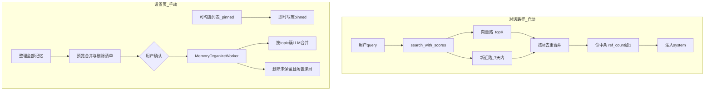

# 长期记忆升级方案（手动整理 + 永久保留）

## 目标与边界

**纳入**

- 检索侧：双路召回（向量 + 新近）、命中后引用强化（`ref_count`）
- 数据侧：`pinned`（永久保留）、`ref_count` 字段及迁移
- 设置页：列表勾选「永久保留」、**整理全部记忆**（预览 → 确认 → `QThread` 执行，合并 + 规则删除）
- 文档：[`docs/07-数据结构.md`](d:\Github\Indra_Desktop_Pet\docs\07-数据结构.md)、[`docs/06-产品需求(PRD).md`](d:\Github\Indra_Desktop_Pet\docs\06-产品需求(PRD).md)、[`docs/04-开发进度.md`](d:\Github\Indra_Desktop_Pet\docs\04-开发进度.md) 相关章节

**明确不做**

- 敏感/letter 层、MCP 独立服务、BGE-M3/KG、每日 `daily_maintenance` 后台任务
- L1/L2/L3 升格与双模型交叉评审
- 应用退出后仍运行的自动整理



---

## 阶段一：数据模型与检索增强

### 1.1 表结构扩展（[`src/llm/long_term_memory.py`](d:\Github\Indra_Desktop_Pet\src\llm\long_term_memory.py)）

在 `memories` 表 `_init_db` 中按现有模式 `PRAGMA table_info` 补列：

| 列 | 类型 | 默认 | 含义 |
|----|------|------|------|
| `ref_count` | INTEGER | NULL 允许 | 被检索命中次数；见下文「旧库迁移」 |
| `pinned` | INTEGER | 0 | 1=用户勾选永久保留，整理删除时跳过 |

- `list_all` / `get_by_id` 返回上述字段
- 新增 `set_pinned(id, pinned: bool) -> bool`

### 1.1.1 旧库兼容与格式升级（无独立迁移工具）

沿用现有 [`long_term_memory.py`](d:\Github\Indra_Desktop_Pet\src\llm\long_term_memory.py) 中 `_init_db` 的 **`PRAGMA table_info` + `ALTER TABLE ADD COLUMN`** 模式（与当年补 `topic` / `topic_embedding` 相同），**不更换** `config/user_memory.db` 路径、不重建表、不要求用户手工导入导出。

| 场景 | 处理方式 |
|------|----------|
| 仅有旧列（id/content/embedding/时间戳） | 启动时自动补 `topic`、`topic_embedding`（已有）、`ref_count`、`pinned` |
| 旧条目 `topic` 为空 | 仍可检索（仅 content 向量）；整理时无 topic 簇的条目走「内容相似度去重」分支，不强行合并 |
| 旧条目 embedding 有效 | 继续用于向量检索，无需重算 |
| 升级后首次打开 | **不执行任何删除/合并**；仅 schema 变更 |

**`ref_count` 三态（避免误删升级前数据）**

| 值 | 含义 | 能否进入「整理删除」候选 |
|----|------|-------------------------|
| `NULL` | 升级前写入的**遗留条**，尚未纳入引用统计 | **否**（默认保护） |
| `0` | 升级后写入或已纳入统计，但对话检索从未命中 | 是（且满足闲置天数、`pinned=0`） |
| `≥1` | 曾在对话检索中命中 | 否 |

迁移 SQL 逻辑（在补列后执行一次）：`UPDATE memories SET ref_count = NULL WHERE ref_count IS NULL`（新列默认 NULL，遗留条保持 NULL）；**新插入**记忆显式写 `ref_count = 0`。`reinforce` 时：`ref_count = COALESCE(ref_count, 0) + 1`（遗留条首次被对话命中后变为 1，此后按正常条目跟踪）。

预览对话框对 `ref_count IS NULL` 的条目单独分组展示，例如「升级前旧记忆（默认不删除，可勾选纳入本次清理）」，避免用户几个月后回来一点「整理」就看到整库待删。

### 1.2 双路检索 + 引用强化

改造 `search_with_scores`（保持对外返回 `List[Tuple[str, float]]` 或扩展为带 `id` 的内部结构，注入层仍用 content）：

1. **向量路**：现有全表余弦 + 混合分（`W_SEM * sim + W_TIME * time_decay`），取候选 top `RECALL_VECTOR_TOP`（建议 5，常量与现 `DEFAULT_TOP_K` 对齐）
2. **新近路**：`updated_at` 在最近 `RECALL_RECENCY_DAYS`（建议 7）天内，按 `updated_at` 降序取 top `RECALL_RECENCY_TOP`（建议 3）
3. **合并**：按 `id` 去重，向量路优先，补足至 `DEFAULT_TOP_K`（5）；`pinned` 条目可在打分上加小幅加权（如 `+0.1`），避免被新近路挤掉
4. **强化**：对最终入选的 `id` 执行 `ref_count += 1` 且 `updated_at = now`（与小红书「recall 命中 reinforce」一致，但仅在真实对话检索时触发，不在整理预览里触发）

[`src/llm/chat_manager.py`](d:\Github\Indra_Desktop_Pet\src\llm\chat_manager.py) 的 `_build_chat_messages` 无需改调用方式；可选在 debug 日志中打印 `id/ref_count`。

### 1.3 常量集中

在 `long_term_memory.py` 顶部新增（便于日后调参，首版可不暴露到 settings.json）：

- `RECALL_RECENCY_DAYS = 7`
- `RECALL_RECENCY_TOP = 3`
- `ORGANIZE_DELETE_IDLE_DAYS = 90`（`ref_count == 0` 且距 `updated_at` 超过该天数且 `pinned == 0` 才进入删除候选）
- `ORGANIZE_MERGE_MIN_CLUSTER = 2`（手动整理时，同 topic 簇 ≥2 条即尝试 LLM 合并；区别于写入时仍保留「满 5 条倍数自动合并」）

---

## 阶段二：手动整理核心逻辑

### 2.1 预览与执行 API（`LongTermMemory`）

新增方法（示意）：

```python
def preview_organize(self) -> dict:
    # returns: { "merge_groups": [...], "delete_candidates": [...] }

def run_organize(self, *, merge_groups=None, delete_ids=None) -> dict:
    # 执行合并与删除，返回统计 merged_count, deleted_count, errors
```

**合并策略**

- 扫描所有带 `topic_embedding` 的行，用现有 `_get_cluster_by_topic_embedding` 思路构建簇（可对每个未处理 id 聚类，已入簇的 id 跳过）
- 簇大小 ≥ `ORGANIZE_MERGE_MIN_CLUSTER` → 进入 `merge_groups`（展示 topic 摘要、条数、content 预览）
- 执行时复用 `_merge_cluster`；为支持 2～4 条小簇，将 `_merge_cluster` 内 `len(cluster) < MERGE_COUNT_MULTIPLE` 的硬限制改为：写入路径仍要求 ≥5，**organize 路径传入 `force=True` 时允许 ≥2**

**删除策略**（用户已选「合并 + 规则删除」）

- 候选：`pinned == 0` 且 **`ref_count = 0`（精确等于 0，不含 NULL）** 且 `days_since(updated_at) >= ORGANIZE_DELETE_IDLE_DAYS`
- 遗留条（`ref_count IS NULL`）：默认不进删除列表；预览中可选「将升级前且从未命中的旧条也纳入删除候选」（高级勾选项，默认关闭）
- 合并后已被 `_merge_cluster` 删除的旧 id 不再出现在删除列表
- **永不**在预览外静默删除；`run_organize` 只处理用户确认后的 `delete_ids` 列表

**同内容去重（轻量，无额外 LLM）**

- 预览阶段可选：对 content 相似度 ≥ `SIMILARITY_THRESHOLD` 的配对，建议保留 `updated_at` 较新的一条，另一条列入 `delete_candidates`（若未 pinned）；在预览 UI 中单独标注「重复项」

### 2.2 后台 Worker（新建 [`src/workers/memory_organize_worker.py`](d:\Github\Indra_Desktop_Pet\src\workers\memory_organize_worker.py)）

- 模式对齐 [`src/workers/model_list_worker.py`](d:\Github\Indra_Desktop_Pet\src\workers\model_list_worker.py)：`finished(dict)` / `error(str)`
- `run()` 内调用 `ltm.run_organize(...)`；LLM 合并通过已有 `merge_llm_caller` 完成（见下节「模型复用」）
- 整理期间由 UI 禁用相关按钮，避免与并发写入冲突；Worker 内用单连接顺序执行，不启动第二个整理任务

---

## 阶段三：设置页 UI（[`src/gui/settings_dialog.py`](d:\Github\Indra_Desktop_Pet\src\gui\settings_dialog.py)）

### 3.1 列表改造

- `QListWidget` 项增加 `Qt.ItemIsUserCheckable`：**勾选 = 永久保留**（`pinned=1`）
- 行文案示例：`[保留] #12 [偏好] 用户不爱吃香菜…` / 未勾选则不显示标记
- 勾选变化时立即调用 `set_pinned`（失败则回滚勾选并提示）

### 3.2 新按钮与流程

| 控件 | 行为 |
|------|------|
| **整理全部记忆** | 调用 `preview_organize` → 弹出 `_MemoryOrganizePreviewDialog`（合并组列表 + 将删除条目列表，注明已排除 N 条已保留） |
| 预览对话框 **执行整理** | 启动 `MemoryOrganizeWorker`；完成后刷新列表并提示统计 |
| 整理进行中 | 禁用整理/删除/清空/编辑，显示「整理中…」；支持 Worker 错误提示 |

新建 [`_MemoryOrganizePreviewDialog`](d:\Github\Indra_Desktop_Pet\src\gui\settings_dialog.py)（或同目录小模块），避免 `settings_dialog.py` 过度膨胀。

### 3.3 前置检查

- 长期记忆模块未连接、embedding 未就绪、或 `merge_llm_caller` 不可用（无 LLM 配置）时，整理按钮点击后给出明确说明，避免半途中断

---

## 阶段四：写入路径、长期未启动与模型复用

### 4.1 写入路径（不变）

- **写入时自动合并**（`add_or_update` 满 5 条倍数）：行为不变
- **手动整理**：仅用户点击「整理全部记忆」并在预览中确认后执行

### 4.2 几个月未打开桌宠：会不会被「清空」？

**不会自动清空。** 本方案**没有**启动时整理、没有后台 TTL 真删；闲置再久也只是：

| 机制 | 几个月未启动后的行为 |
|------|---------------------|
| 对话检索 | 旧条 `updated_at` 偏久 → **时间衰减分变低**，但仍可能靠语义相似度进入 top5；不会删行 |
| 新近路（7 天） | 旧条进不了新近路，**不影响**是否仍留在库中 |
| `ref_count` | 遗留条为 `NULL` 时**不会**因「0 次引用」进删除候选 |
| 物理删除 | **仅**用户主动「整理」且预览确认后发生 |

因此：几个月后重新打开，**只要不点整理并确认删除**，记忆库条数不变。唯一需要注意的是：若用户主动整理且勾选「纳入升级前旧条」，预览里可能出现大量候选——这正是预览 + 永久保留勾选要解决的问题。

建议在预览顶部固定文案：「删除仅作用于您确认后的列表；勾选『永久保留』的条目永远不会出现在删除列表中。」

### 4.3 整理 / 合并用模型：与聊天相同

**不引入**独立本地裁判模型（如 Ollama Qwen）或第二套 API 配置。继续复用现有链路：

- [`ChatManager.__init__`](d:\Github\Indra_Desktop_Pet\src\llm\chat_manager.py) 已注入 `merge_llm_caller=lambda msgs: self._request_llm_json_light(msgs)`
- `_request_llm_json_light` → `json_only_policy` → `_request_llm` → **`ModelService` + `settings` 中的聊天 binding**（`base_url` / `api_key` / `model` 与主对话一致）

整理预览前置检查：聊天模型配置不完整时禁用「执行整理」，提示「请先在模型设置中配置与聊天相同的 API」，避免半途中断。屏幕观察抽取记忆亦同此 binding，无需新增设置项。

---

## 阶段五：文档与验证

| 文档 | 更新内容 |
|------|----------|
| [`docs/07-数据结构.md`](d:\Github\Indra_Desktop_Pet\docs\07-数据结构.md) | `ref_count`（含 NULL 遗留语义）、`pinned`；迁移说明；双路检索；整理/删除规则 |
| [`docs/06-产品需求(PRD).md`](d:\Github\Indra_Desktop_Pet\docs\06-产品需求(PRD).md) | 记忆管理：永久保留勾选、手动整理预览 |
| [`docs/04-开发进度.md`](d:\Github\Indra_Desktop_Pet\docs\04-开发进度.md) | 勾选待办/完成项 |

**建议手测**

1. 开启长期记忆 → 写入若干条（含同 topic 多条、超 90 天未更新可用改系统时间或临时调低 `ORGANIZE_DELETE_IDLE_DAYS` 验证）
2. 对话检索后检查 `ref_count` 增加
3. 勾选保留 → 整理预览中该条不在删除列表 → 确认后仍保留
4. 未勾选且闲置条出现在预览 → 确认后删除
5. **旧库升级**：用含历史数据的 `user_memory.db` 启动 → 条数不变、`ref_count` 为 NULL → 预览删除列表不含遗留条 → 对话命中一条后该条 `ref_count≥1`
6. **长期未启动**：改系统时间或闲置条 → 启动后不整理则条数不变；仅整理预览出现候选
7. 整理过程中关闭设置窗 / 杀进程：因无后台任务，最多丢失「进行中」那一次，数据库不因半进程维护损坏（单事务 per 合并/删除）

---

## 实现顺序建议

1. DB 迁移 + `set_pinned` + `list_all` 扩展  
2. `search_with_scores` 双路 + reinforce  
3. `preview_organize` / `run_organize` + `_merge_cluster(force=)`  
4. `MemoryOrganizeWorker` + 预览对话框 + 设置页 UI  
5. 文档同步  

## 后续可选（本方案不实现）

- 整理时增加轻量 LLM 判 `duplicate/evolution/contradict`（仅预览、用户确认，成本更高）
- 将 `ORGANIZE_DELETE_IDLE_DAYS` 暴露到 settings.json
- 记忆列表按 `ref_count` / `updated_at` 排序
