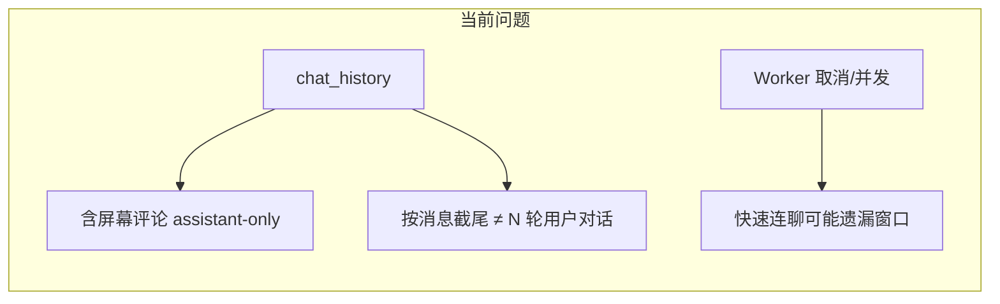
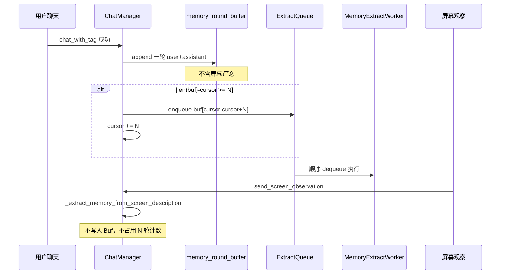
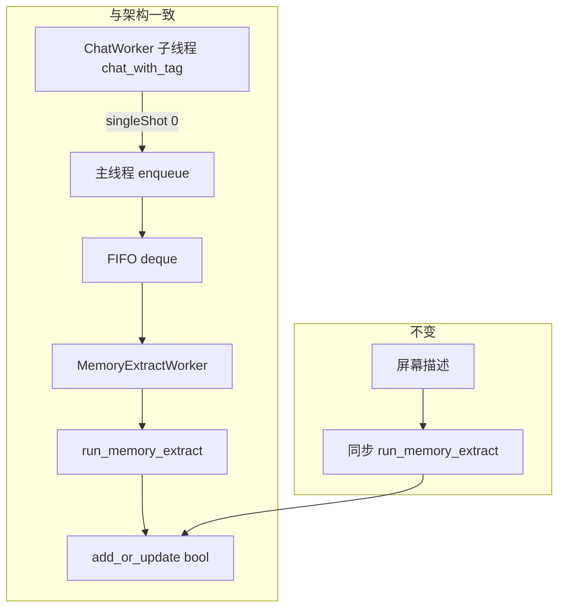

# 长期记忆取样与 Prompt 优化

## 现状与问题

当前 [`chat_manager._schedule_memory_extract()`](src/llm/chat_manager.py) 在每次**用户聊天**成功后：

1. `_completed_chat_rounds += 1`，仅当 `rounds % N == 0` 时触发
2. 取样：`history_slice = chat_history[-2*N:]`（按**消息条数**截尾）

**设计意图（N 的含义）** 与用户期望一致：每累计 **N 轮用户聊天**，将这 **连续 N 轮** 一并送记忆模型判定。  
**实现偏差**在于：

| 偏差 | 说明 |
|------|------|
| 样本来源 | 屏幕观察通过 `_append_assistant("【刚刚对屏幕的评论】…")` 写入 [`chat_history`](src/llm/chat_manager.py)，会插入 `history_slice`，与用户聊天轮错位；屏幕已有独立通道 [`_extract_memory_from_screen_description()`](src/llm/chat_manager.py) |
| 截尾方式 | `2*N` 条消息 ≠ N 轮 `(user, assistant)`，中间夹屏幕评论时会漏轮/混轮 |
| 并发 | 新任务 `requestInterruption()` 旧 Worker，快速连聊时中间窗口可能未执行（你已选择**排队顺序执行**） |

N=2 时在**纯用户聊天、无屏幕插入**的理想情况下，现有 `% N` + 截尾逻辑本身是无重叠、无遗漏的；问题主要来自 **chat_history 污染** 与 **Worker 并发**。

---

## 目标行为（优化后）

- **无遗漏**：游标 `cursor` 只前进，每 N 轮用户聊天恰好提交 `[cursor : cursor+N)` 一次
- **无重复**：相邻两次提交窗口不重叠
- **屏幕隔离**：聊天批次样本不含 `【刚刚对屏幕的评论】`；屏幕仍走独立抽取
- **排队**：多批待抽取按 FIFO 顺序执行，不 cancel 丢弃

---

## 实现方案

### 1. 新增取样模块（建议 [`src/llm/memory_extract_sampling.py`](src/llm/memory_extract_sampling.py)）

纯函数 + 小数据结构，便于单测：

- `is_screen_comment_message(msg) -> bool`：复用 [`memory_extract._SCREEN_COMMENT_PREFIX`](src/llm/memory_extract.py)，避免与 [`chat_manager._append_assistant`](src/llm/chat_manager.py) 前缀漂移
- `MemoryRoundBuffer`：
  - `append_round(user_msg, assistant_msg)` → 存 `[{role,user},{role,assistant}]`
  - `cursor: int` 已提交轮数
  - `pending_slices(n) -> list[list[dict]] | None`：若 `len(rounds) - cursor >= n`，返回 `rounds[cursor:cursor+n]` 扁平化后的 messages，**不**修改 cursor（由调用方 commit）
  - `commit(n)`：`cursor += n`；并 **trim** `rounds[:cursor]` 释放内存（buffer 仅内存、不持久化，重启后从空开始——需在 docs 说明）
- `build_chat_extract_slice(rounds, cursor, n) -> list[dict]`：封装上述逻辑

从 [`build_extract_user_payload()`](src/llm/memory_extract.py) 中移除对屏幕前缀的「 strip 后仍保留」行为，改为在取样阶段直接**排除**屏幕评论消息（双保险）。

### 2. 重构 [`ChatManager`](src/llm/chat_manager.py)

- 新增字段：`_memory_round_buffer`、`MemoryExtractQueue`（或简单 `deque` + `_extract_worker_busy` 标志）
- **`chat_with_tag` 成功路径**（`_append_assistant` 之后）：
  - 向 buffer 追加本轮 user+assistant（从 `chat_history` 末两条或构造时直接传入，避免再次扫 history）
  - 当 `pending` 满足 N：生成 slice → **入队** → `commit(N)` → 启动/唤醒 queue processor
- **删除/替换** `_schedule_memory_extract` 中对 `chat_history[-2*n:]` 与 `_completed_chat_rounds % n` 的逻辑
- **屏幕观察**：保持 `_extract_memory_from_screen_description` 不变；确保**不**调用聊天批次 enqueue

### 3. 抽取任务排队（[`workers/memory_extract_worker.py`](src/workers/memory_extract_worker.py) + ChatManager）

按你的选择实现 **FIFO 队列**：

- `ChatManager._enqueue_memory_extract(history_slice, batch_id)` 入队 `(slice, batch_id)`
- 单一 Worker 链式 `finished → _process_memory_extract_queue`：
  - 当前 Worker 运行中 → 只入队
  - Worker 完成 → 取下一项再 `start()`
- **移除**对旧 Worker 的 `requestInterruption()`（避免丢窗口）
- **移除** `_on_memory_extract_finished/error` 中 `generation_id != _memory_extract_generation` 的丢弃逻辑（与 FIFO 冲突）；`batch_id` 仅用于日志
- **主线程调度**：`chat_with_tag` 现由 [`ChatWorker`](src/workers/chat_worker.py) 在子线程调用；入队与 `worker.start()` 须经 `QTimer.singleShot(0, …)` 投递到主线程（Qt 线程安全，与现有架构文档「Worker 由 UI 侧管理」一致）
- 日志示例：`[MemoryExtract] 入队批次 #k（第 3–4 轮用户对话，共 4 条，不含屏幕评论）`

### 4. 写库可靠性（小修复，同一 PR）

[`MemoryExtractWorker`](src/workers/memory_extract_worker.py) + [`LongTermMemory.add_or_update()`](src/llm/long_term_memory.py)：

- `add_or_update` 返回 `bool`（embedding 失败时 `False`）
- Worker 仅在实际写入/更新成功时 `written += 1`
- embedding 未就绪时打印 `[MemoryExtract] 向量未就绪，跳过写入`（与知识库 `_embed_ready` 对齐）

### 5. 放宽 Prompt：[`config/prompts/memory_extract.md`](config/prompts/memory_extract.md)

在「应记录」中补充（保持 JSON 输出格式不变）：

- 用户在 RP/闲聊中**明确透露**的自身偏好、身份、经历、关系、长期计划（区分于纯剧情设定）
- 用户多次提及的兴趣、常用工具/游戏/作品、作息或进行中的长期活动（具延续性即可）
- 用户对助手/称呼/交流方式的稳定要求

在「不应记录」中微调：

- 仍排除纯角色台词与一次性寒暄
- 明确：**因陀罗/助手的评价本身不记**，但其中引出的**用户事实**仍应记

可选：在 user payload 首行加一句「以下为用户与助手的日常对话，忽略角色扮演中的虚构情节，只提取关于用户本人的事实」。

### 6. 设置页与文档

- [`settings_dialog.py`](src/gui/settings_dialog.py)：`附带对话轮数 N` 旁增加 tooltip——「每 N **轮用户聊天**结束后，将连续 N 轮一并送记忆模型；不含屏幕评论；样本不重叠不遗漏」
- [`用户手册.html`](用户手册.html) 3.4 节同步说明
- [`docs/07-数据结构.md`](docs/07-数据结构.md)：`extract_context_rounds` = 每 N **轮用户聊天**连续批次
- [`docs/02-技术要点.md`](docs/02-技术要点.md) §3.4：替换「N=1 每轮；N>1 每 N 轮一次」为无重叠连续 N 轮语义；不含屏幕评论
- [`docs/06-产品需求(PRD).md`](docs/06-产品需求(PRD).md)「最近 N 轮对话」→「最近 N 轮**用户聊天**」
- [`docs/03-程序架构.md`](docs/03-程序架构.md)：模块表增 `memory_extract_sampling.py`；线程表补 `MemoryExtractWorker`；聊天流 MEW 改为「入队→顺序 dequeue」
- [`docs/04-开发进度.md`](docs/04-开发进度.md)：完成本优化后勾选/简述
- [`docs/05-开发环境配置.md`](docs/05-开发环境配置.md) §记忆管理：与 N 语义一致

### 7. 测试

新增 [`tests/test_memory_extract_sampling.py`](tests/test_memory_extract_sampling.py)：

- N=2：4 轮用户聊天 → 产生 2 个 slice，覆盖 1–2、3–4，无重叠
- 中间插入屏幕评论到 chat_history（模拟）→ buffer 不受影响
- cursor 推进后无重复窗口

---

## Build 前自查（架构 / docs 对齐与风险）

### 与现有架构的对齐情况

| 维度 | 结论 | 说明 |
|------|------|------|
| 模块分层 | 对齐 | 取样纯逻辑放 `llm/memory_extract_sampling.py`，与 `memory_extract.py` / `chat_pipeline` 分工一致；排队调度留在 `ChatManager`，与 `_chat_worker` / 屏幕 Worker 占位模式一致 |
| Worker 模式 | 对齐 | 仍用 `MemoryExtractWorker(QThread)` + `run_memory_extract()`，不新建顶层 Queue 类 |
| 双通道记忆 | 对齐 | 聊天批次 vs [`_extract_memory_from_screen_description`](src/llm/chat_manager.py) 独立路径，符合 [`docs/03`](docs/03-程序架构.md) 四条 LLM 通道表 |
| 触发条件 | 对齐 | 仍在 JSON 解析成功、`_append_assistant` 之后；解析失败不 append、不抽取（[`docs/02`](docs/02-技术要点.md) §3.4） |
| 配置入口 | 对齐 | `SettingsManager.get_memory_extract_context_rounds()`，1–5 范围不变 |
| 设置页探测 | 需留意 | [`probe_memory_extract_dry_run`](src/llm/providers/capabilities.py) 用固定短样本，不经 buffer；若改 `build_extract_user_payload` 首行提示，探测文案可不改，但正式 payload 与探测样本语义应仍一致 |
| 原 plan 缺口 | **已补** | `generation_id` 防 stale 与 FIFO 冲突；ChatWorker 子线程 `start()`；buffer 内存 trim；常量复用 `_SCREEN_COMMENT_PREFIX` |

### 与 `/docs` 规范的对齐情况

- **已覆盖 PRD/架构意图**：[`docs/06`](docs/06-产品需求(PRD).md) 聊天记忆 + 屏幕二次抽取分离；本 plan 强化「N 轮 = 用户聊天轮」。
- **实现后必须同步**（项目总则表格）：`02` 触发语义、`03` 模块/线程/数据流、`04` 进度、`05` 记忆管理说明、`07` 字段语义、用户手册 3.4。
- **当前 docs 与代码的已知偏差**（本 PR 顺带修正描述，非范围外重构）：[`docs/03`](docs/03-程序架构.md) 线程表未列 `MemoryExtractWorker`；聊天 mermaid 暗示 MEW 紧跟 UI，实际在 `chat_with_tag` 内调度。

### 潜在风险与缓解

| 风险 | 级别 | 缓解 |
|------|------|------|
| FIFO 后仍用 `generation_id` 丢弃 finished 回调 | 高 | 移除 stale 丢弃；每批 `batch_id` 只打日志 |
| `ChatWorker` 子线程调用 `QThread.start()` | 中（既有） | 入队/启动改 `QTimer.singleShot(0, …)` 到主线程；本 PR 一并处理 |
| `MemoryRoundBuffer.rounds` 无限增长 | 中 | `commit` 后丢弃 `rounds[:cursor]` |
| 进程重启 buffer/cursor 丢失 | 低 | 接受；未提交尾部可能重复送模或丢失一次窗口；文档注明不持久化 |
| 连聊队列积压 → API 耗时/费用 | 低（已接受） | 顺序执行 + 入队日志；不 cancel |
| 放宽 `memory_extract.md` → RP 误记 | 中 | 保留「用户事实层、第三人称」；payload 首行忽略 RP 虚构 |
| `add_or_update` 改 bool | 低 | 仅 2 处调用：Worker + 屏幕同步路径 |
| embedding 未就绪静默跳过 | 中 | bool + `[MemoryExtract] 向量未就绪` 日志（plan §4） |
| 运行中改 N | 低 | 每次 enqueue 读当前 `get_memory_extract_context_rounds()`；余数轮自然等待新 N |
| 退出时队列未 flush | 低 | 不在范围；可选 follow-up |
| 单测基建 | 低 | 沿用 [`tests/test_chat_parse.py`](tests/test_chat_parse.py) 的 `sys.path` 模式 |

---

## 不在本次范围

- 不改变 N 的默认值（仍为 1）
- 不合并多批为单次 API（你已选排队）
- 不改动屏幕观察独立抽取的 prompt 结构（仅聊天批次隔离）
