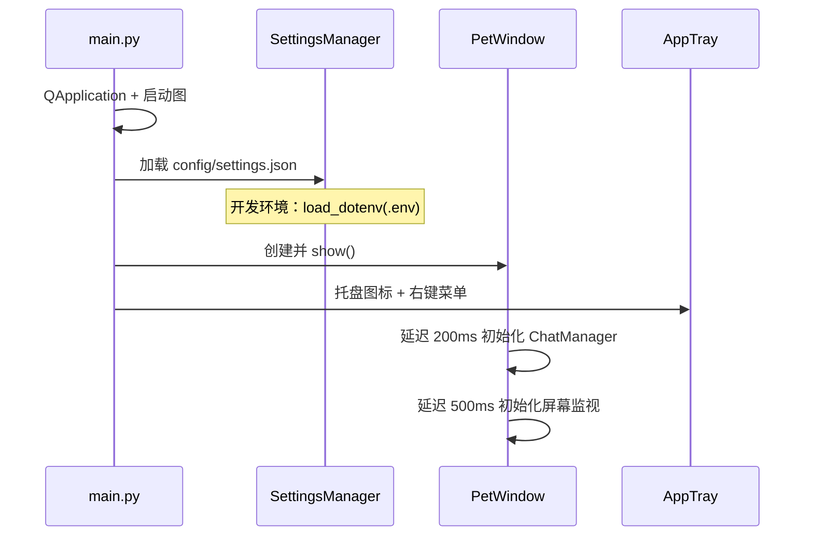
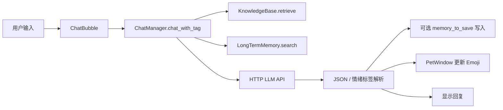
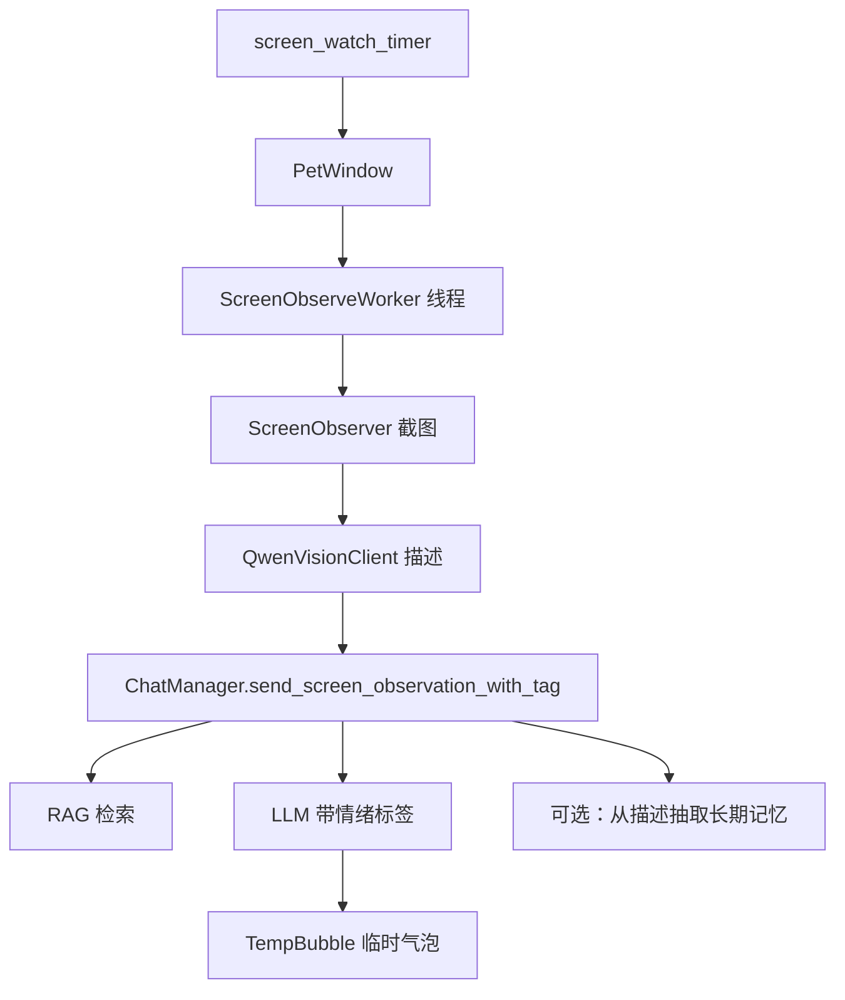

# 程序架构

## 1. 总体分层

```
┌─────────────────────────────────────────────────────────┐
│  表现层 (gui/)                                           │
│  PetWindow · ChatBubble · SettingsDialog · AppTray       │
│  AnimationDriver · TempBubble                            │
├─────────────────────────────────────────────────────────┤
│  业务层                                                  │
│  ChatManager · KnowledgeBase · LongTermMemory            │
│  ScreenObserver · QwenVisionClient                       │
├─────────────────────────────────────────────────────────┤
│  基础设施                                                │
│  SettingsManager · ResourceManager · ScreenObserveWorker  │
└─────────────────────────────────────────────────────────┘
```

## 2. 启动流程



关键文件：

- `src/main.py` — 入口，组装 SM / PetWindow / AppTray
- `src/settings_manager.py` — 单例配置，开发环境 `.env` 优先
- `src/utils.py` — `resource_path()` 统一开发/打包路径

## 3. 模块职责

| 模块 | 文件 | 职责 |
|------|------|------|
| 桌宠主窗 | `gui/pet_window.py` | 窗口属性、拖拽缩放、聊天/设置/观察调度、临时气泡 |
| 动画 | `gui/animation.py` | idle 帧动画、情绪 Emoji 显示 |
| 聊天气泡 | `gui/chat_bubble.py` | 独立悬浮聊天 UI，异步调用 ChatManager |
| 设置 | `gui/settings_dialog.py` | 基础/模型/记忆管理三标签页 |
| 托盘 | `gui/tray.py` | 托盘菜单、开关状态文案同步 |
| 对话 | `llm/chat_manager.py` | Prompt 组装、RAG/记忆注入、LLM 请求、JSON 解析 |
| 知识库 | `llm/knowledge_base.py` | lore/style 双索引、异步加载、增量重建 |
| 长期记忆 | `llm/long_term_memory.py` | SQLite 存储、混合评分检索、同主题合并 |
| 截图 | `vision/screen_observer.py` | mss 全屏截图、隐藏桌宠、清理旧图 |
| 视觉 | `vision/qwen_vision.py` | Base64 多模态 API |
| 工作线程 | `workers/screen_observer_worker.py` | 截图→描述→评论，避免阻塞 UI |

## 4. 聊天数据流



**System Prompt 组成**（`_build_chat_messages`）：

1. `persona.txt` + 用户称呼
2. RAG 检索片段（lore + style）
3. 长期记忆块（开关开启时）
4. JSON 输出格式说明

## 5. 屏幕观察数据流



截图前通过 Qt Signal 让主线程将桌宠透明度设为 0，避免拍到自己。

## 6. 线程与异步模型

| 任务 | 执行上下文 |
|------|------------|
| UI 事件、动画 | Qt 主线程 |
| KnowledgeBase 索引加载 | `threading.Thread`（daemon） |
| 屏幕观察全流程 | `QThread`（ScreenObserveWorker） |
| LLM HTTP | 在 Worker 或 ChatBubble 触发的线程中同步 `requests.post` |

知识库加载完成前，RAG 检索可能为空；程序通过 Signal 通知 UI（如加载提示）。

## 7. 配置热更新

`SettingsManager.settings_changed` 信号连接至：

- `PetWindow._on_settings_changed` — 缩放、屏幕监视间隔、字体等
- `AppTray._update_menu_status` — 托盘菜单「屏幕监视/长期记忆」文案

保存设置后立即生效，无需重启。

## 8. 打包 vs 开发差异

| 行为 | 开发环境 | PyInstaller 打包 |
|------|----------|------------------|
| 资源根路径 | 项目根目录 | `sys._MEIPASS` |
| API 密钥 | `.env` 优先 | 仅 settings.json |
| knowledge_db 写入 | 项目内 `src/llm/knowledge_db/` | 只读包内路径，逻辑见 `_get_persist_dir` |
