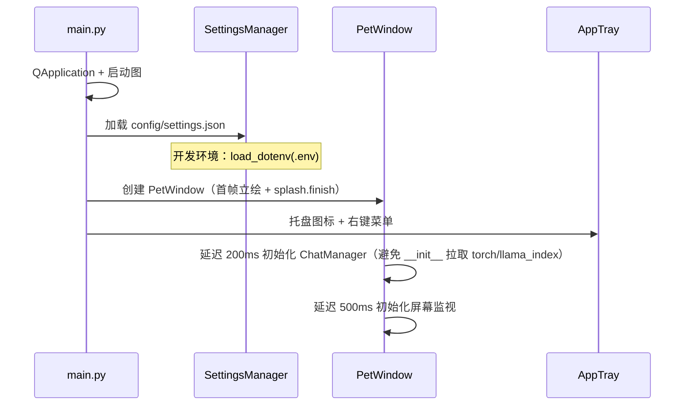
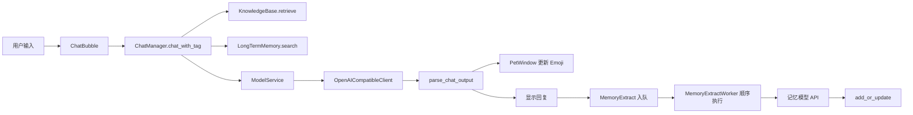
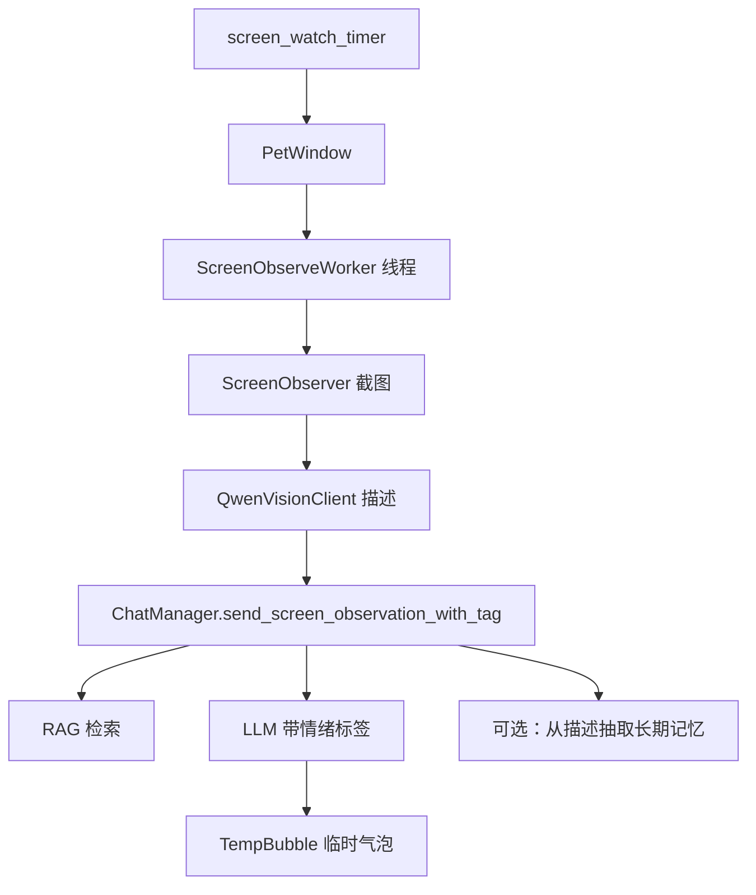

# 程序架构

## 1. 总体分层

```
┌─────────────────────────────────────────────────────────┐
│  表现层 (gui/)                                           │
│  PetWindow · ChatBubble · SettingsDialog · AppTray       │
│  AnimationDriver · TempBubble                            │
├─────────────────────────────────────────────────────────┤
│  业务层                                                  │
│  ChatManager · KnowledgeBase · LongTermMemory            │
│  ScreenObserver · QwenVisionClient                       │
├─────────────────────────────────────────────────────────┤
│  基础设施                                                │
│  SettingsManager · ResourceManager · ScreenObserveWorker  │
└─────────────────────────────────────────────────────────┘
```

## 2. 启动流程



`PetWindow` 构造时仅加载 idle 首帧；`idle_frames_loaded` 须在信号连接后由 `_on_idle_frames_loaded()` 触发 `show()` 与 `splash.finish()`，不可在 `AnimationDriver.__init__` 内同步 emit。

关键文件：

- `src/main.py` — 入口，组装 SM / PetWindow / AppTray
- `src/settings_manager.py` — 单例配置，开发环境 `.env` 优先
- `src/utils.py` — `resource_path()` 统一开发/打包路径

## 3. 模块职责

| 模块 | 文件 | 职责 |
|------|------|------|
| 桌宠主窗 | `gui/pet_window.py` | 窗口属性、拖拽缩放、聊天/设置/观察调度、临时气泡 |
| 动画 | `gui/animation.py` | idle 帧动画、情绪 Emoji 显示 |
| 聊天气泡 | `gui/chat_bubble.py` | 独立悬浮聊天 UI；用户消息即时显示，LLM 由 `ChatWorker` 异步调用 |
| 设置 | `gui/settings_dialog.py` | 基础/模型（对话与识图 API）/记忆管理（记忆 API + 列表整理） |
| 托盘 | `gui/tray.py` | 托盘菜单、开关状态文案同步 |
| 模型服务 | `llm/model_service.py` | 解析 `models` 配置、统一 HTTP 客户端 |
| OpenAI 客户端 | `llm/clients/openai_compatible.py` | chat/completions、识图、URL 规范化 |
| Vendor 注册表 | `llm/providers/registry.json` | 预置服务商 base_url |
| 输出策略 | `llm/output_modes.py` | JSON 降级链（auto） |
| 聊天管道 | `llm/pipelines/chat_pipeline.py` | 聊天 JSON 指令、策略调用、解析与重试提示 |
| 响应解析 | `llm/parsers/chat_response.py`、`json_extract.py` | 安全 JSON 提取、`ChatParseResult` |
| 对话 | `llm/chat_manager.py` | history、RAG/记忆调度、委托 chat_pipeline |
| 知识库 | `llm/knowledge_base.py` | lore/style 双索引、异步加载、增量重建；嵌入单锁 + 就绪门控 |
| 长期记忆 | `llm/long_term_memory.py` | SQLite、双路检索、`ref_count`/`pinned`、设置页手动整理 |
| 截图 | `vision/screen_observer.py` | mss 全屏截图、隐藏桌宠、清理旧图 |
| 视觉（兼容） | `vision/qwen_vision.py` | 薄封装，委托 OpenAICompatibleClient |
| 工作线程 | `workers/screen_observer_worker.py` | 截图→描述→评论，避免阻塞 UI |
| 工作线程 | `workers/chat_worker.py` | 用户聊天 RAG+LLM，避免聊天气泡假死 |
| 模型列表 Worker | `workers/model_list_worker.py` | 后台拉取 /v1/models |
| 能力探测 Worker | `workers/capability_probe_worker.py` | 测试连接/识图 |
| LLM 响应解析 | `llm/clients/llm_response.py`、`response_utils.parse_chat_completion` | 统一拆出 `content`（正文）与 `reasoning`（思考链），UI 分开展示 |
| 记忆抽取 | `llm/memory_extract.py` | 独立 prompt、JSON 解析、记忆模型 API |
| 记忆取样 | `llm/memory_extract_sampling.py` | 用户聊天轮缓冲、游标、屏幕评论过滤 |
| 记忆抽取 Worker | `workers/memory_extract_worker.py` | 聊天回复后 FIFO 排队异步写库 |

## 4. 聊天数据流



**System Prompt 组成**（`_build_chat_messages`）：

1. `persona.txt` + 用户称呼
2. RAG 检索片段（lore + style）
3. 长期记忆块（开关开启时）
4. JSON 输出格式说明（仅 `reply` + `emotion`；`response_format` 模式下不要求 Markdown 代码块）

**四条 LLM 通道**（schema 勿混用）：

| 通道 | 模型 | 输出 |
|------|------|------|
| 聊天 | `models.chat` | `{reply, emotion}` |
| 屏幕评论 | `models.chat` | 自然语言 + 【情绪】 |
| 聊天/屏幕记忆抽取 | `models.memory` | `{memories:[]}`（`memory_extract.md`） |
| 识图 | `models.vision` | 屏幕描述文本 |

## 5. 屏幕观察数据流



截图前通过 Qt Signal 让主线程将桌宠透明度设为 0，避免拍到自己。

## 6. 线程与异步模型

| 任务 | 执行上下文 |
|------|------------|
| UI 事件、动画 | Qt 主线程 |
| KnowledgeBase 索引加载 | `threading.Thread`（daemon） |
| 屏幕观察全流程 | `QThread`（ScreenObserveWorker） |
| 用户聊天 LLM | `QThread`（ChatWorker） |
| 聊天记忆抽取 | `QThread`（MemoryExtractWorker，FIFO 排队顺序执行） |
| LLM HTTP | 在 Worker 线程中同步 `requests.post` |

知识库加载完成前，RAG 检索返回空（`_indices_ready` 门控，不调用 embed）；`ChatManager._retrieve_knowledge` 捕获异常时亦降级为空。嵌入模型与索引构建/检索共用 `threading.Lock`，避免并发 `encode` 导致 IndexError。重建索引期间 `_rebuild_in_progress` 跳过 RAG。UI 通过 Signal 提示加载状态。

## 7. 配置热更新

`SettingsManager.settings_changed` 信号连接至：

- `PetWindow._on_settings_changed` — 缩放、屏幕监视间隔、字体等
- `AppTray._update_menu_status` — 托盘菜单「屏幕监视/长期记忆」文案

保存设置后立即生效，无需重启。

## 8. 打包 vs 开发差异

| 行为 | 开发环境 | PyInstaller 打包 |
|------|----------|------------------|
| 只读资源 | 项目根目录 | `_internal`（`resource_path`） |
| 可写配置/记忆/截图 | 项目根目录 | exe 同级（`user_data_path`） |
| API 密钥 | `.env` 优先 | exe 旁 `config/settings.json` |
| knowledge_db 读取 | 项目内 `src/llm/knowledge_db/` | 只读包内路径（`_get_persist_dir`） |
